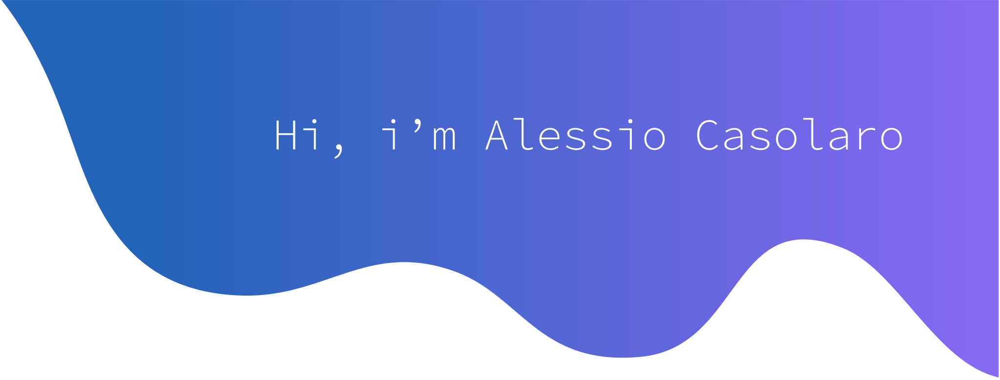

---

<!--
**BearGrillz99/BearGrillz99** is a ✨ _special_ ✨ repository because its `README.md` (this file) appears on your GitHub profile.
# Hi there, I'm Alessio Casolaro 
Here are some ideas to get you started:

- 🔭 I’m currently working on ...
- 🌱 I’m currently learning ...
- 👯 I’m looking to collaborate on ...
- 🤔 I’m looking for help with ...
- 💬 Ask me about ...
- 📫 How to reach me: ...
- 😄 Pronouns: ...
- ⚡ Fun fact: ...
-->
---

<h2 align="center">Let's Connect ☕</h2>

 
  
  
  
  
  
  

